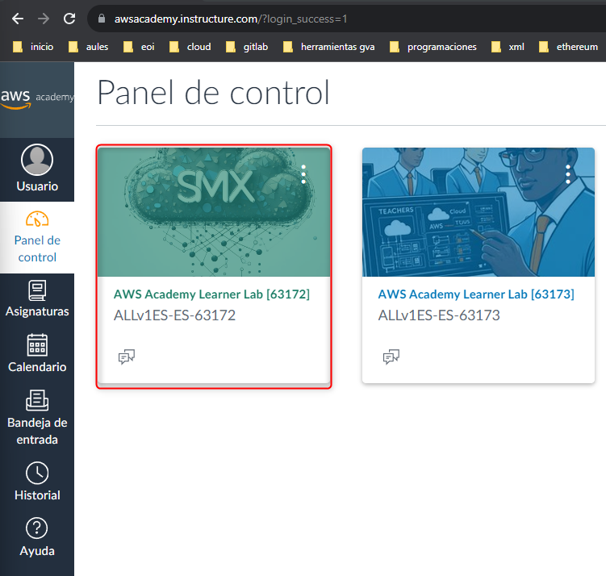
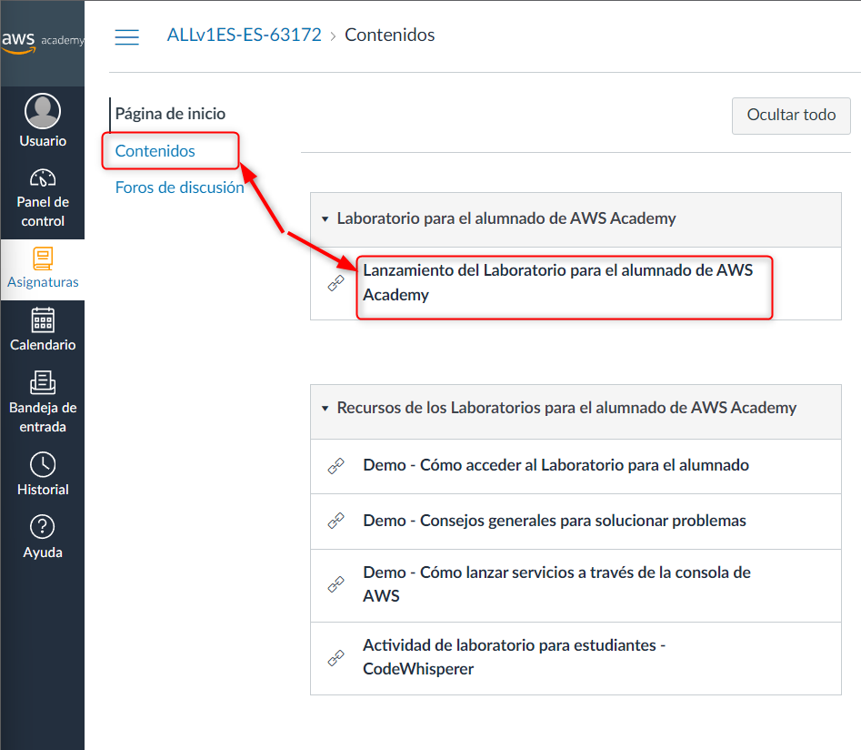
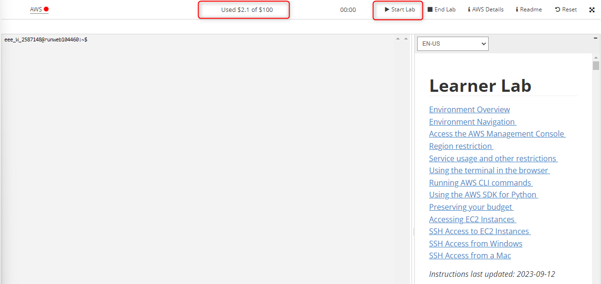
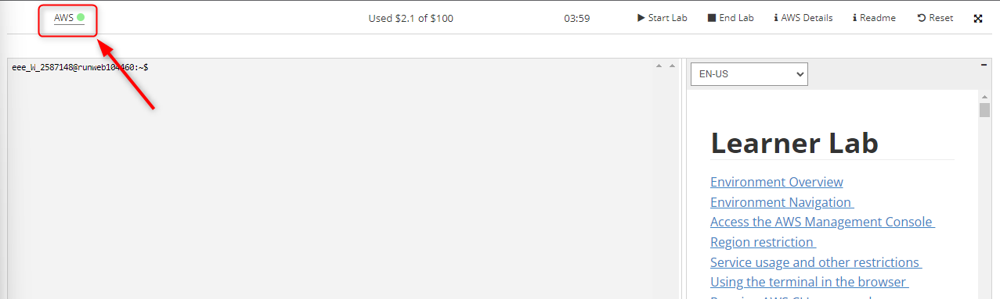
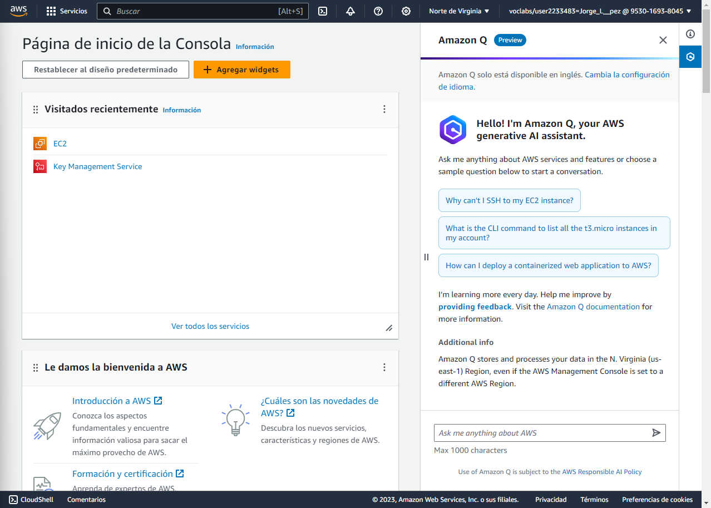

# Lanzamiento el laboratorio de AWS Academy

### Acceso a AWS Academy

1.- En primer lugar nos validamos con nuestro usuario y contraseña en la página de AWS Academy

[AWS Academy](https://www.awsacademy.com/)

 
___

### Acceso al Learner Lab

2.- En el panel de control de los cursos disponibles seleccionamos el *Learner Lab* correspondiente.

 
___

3.- En el apartado **Contenidos** pulsamos sobre la opción **Lanzamiento del laboratorio**.

 

### Lanzamiento del laboratorio

4.- Se abre una nueva ventana con el entorno virtual de AWS en el que se nos muestra el crédito en dólares que nos queda para realizar pruebas en un entorno real.

Pulsamos sobre el botón **Start Lab**.

 
___

5.- Esperamos a que el icono situado a la derecha del texto **AWS** pase a verde, y pulsamos sobre el texto **AWS**. 

 
___

6.- Accedemos a la **consola de AWS** en un entorno real en la nube (con servicios restringidos).

