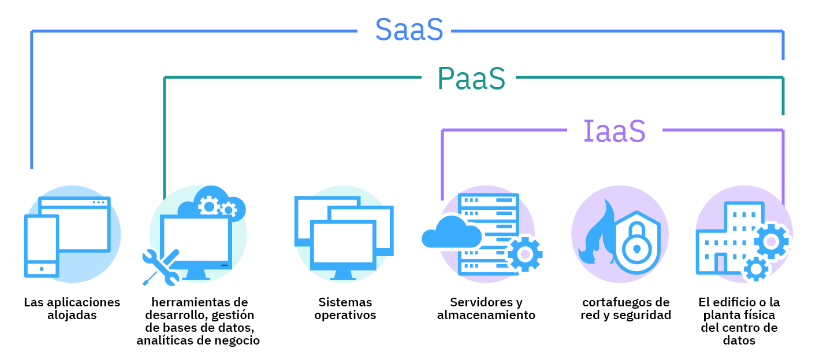
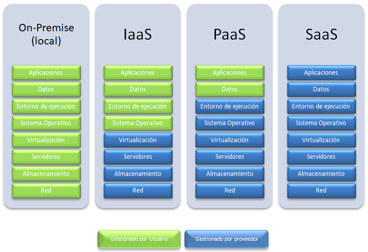
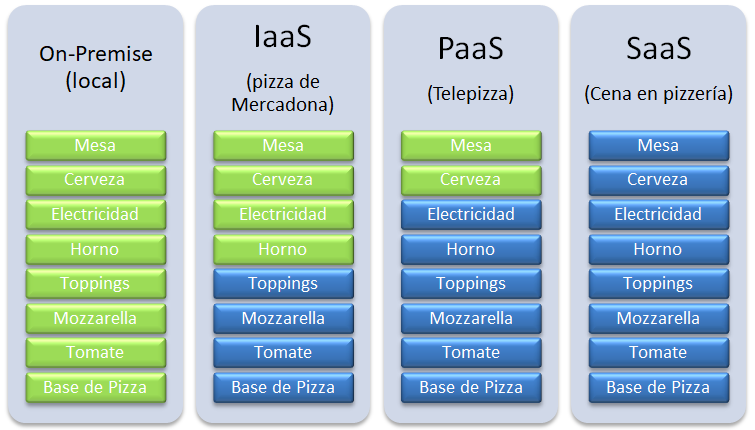
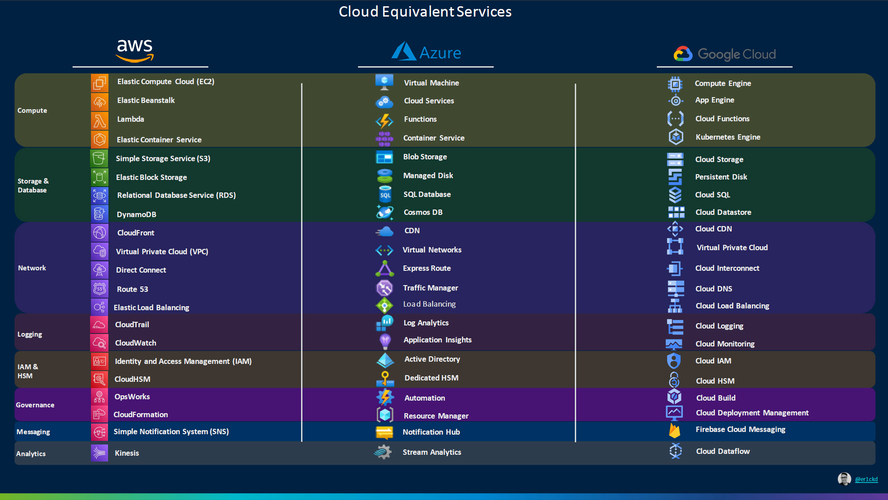

# Tema 1. Arquitectura en la nube de AWS Academy

## Introducción a Cloud Computing
El Cloud Computing o computación en la nube es un modelo de prestación de servicios informáticos que permite acceder a recursos como servidores, almacenamiento, bases de datos, redes, software y más, a través de Internet y bajo demanda. En lugar de instalar y mantener infraestructura física localmente, las empresas y usuarios acceden a estos servicios desde centros de datos remotos gestionados por proveedores como **Amazon Web Services (AWS)**, **Microsoft Azure** o **Google Cloud**.

La computación en la nube se distingue por la noción de que los recursos son virtuales y sin límites y que los detalles de los sistemas físicos en los que se ejecuta el software se abstraen al usuario. Cuando un usuario ejecuta una aplicación en la nube desconoce por completo el hardware que está utilizando, la plataforma sobre la que corre, etc. Cuando almacenamos datos en Dropbox, o leemos el correo en Gmail o editamos una hoja de cálculo en OneDrive desde un ordenador o una tableta, desconocemos los sistemas físicos sobre los que trabajamos, ni la plataforma, ni la ubicación de los servidores, ni nada por el estilo. Lo vemos de manera abstracta. Una nube.

Este modelo se basa en el pago por uso, lo que permite a los usuasurio o las organizaciones consumir solo los recursos que necesitan en cada momento.

### ¿Qué ventajas nos proporciona el Cloud Computing?
Migrar nuestra estructura física hacia un modelo de computación en la nube nos puede proporcionar una serie de ventajas con respecto al modelo tradicional (llamado *on-premise*):

1. **Escalabilidad**: La nube permite aumentar o disminuir los recursos (como potencia de cálculo, almacenamiento o capacidad de red) de forma sencilla y rápida según las necesidades del momento. Esto es ideal para empresas con cargas de trabajo variables o en crecimiento.
2.	**Elasticidad**: La elasticidad va un paso más allá: permite que los sistemas se ajusten automáticamente a los cambios de demanda, añadiendo o quitando recursos sin intervención humana. Por ejemplo, una web que recibe muchas visitas en horas punta puede ampliar sus servidores automáticamente y luego reducirlos cuando baja la carga.
3.	**Ahorro de costos**: Al eliminar la necesidad de comprar, instalar y mantener hardware local, el cloud computing reduce significativamente los costos iniciales. Además, el modelo de pago por uso evita pagar por recursos infrautilizados.
4.	**Disponibilidad global**: Los servicios en la nube están disponibles desde cualquier lugar con conexión a Internet, lo que facilita el trabajo remoto, el acceso desde distintas ubicaciones y el despliegue internacional de aplicaciones.
5.	**Seguridad:** Aunque suele haber dudas al respecto, los proveedores de nube invierten grandes recursos en proteger sus infraestructuras. Ofrecen herramientas avanzadas de cifrado, control de accesos, copias de seguridad y cumplimiento de normativas internacionales, que suelen ser más seguras que muchas soluciones locales mal gestionadas.

### Inconvenientes del Cloud Computing
1.	**Dependencia de la conexión a Internet**: Si no se dispone de una conexión estable y rápida, el acceso a los servicios puede verse comprometido. 
2. **Latencia:**: Dependiendo de la ubicación del servidor y la calidad de la conexión, puede haber retrasos en la respuesta (latencia), lo cual afecta el rendimiento de algunas aplicaciones.
3.	**Pérdida de control sobre la infraestructura**: Al estar alojados en servidores externos, los usuarios no tienen acceso físico ni completo control sobre los sistemas, lo que puede ser una desventaja en algunos contextos empresariales.
4.	**Costes a largo plazo**: Aunque el coste inicial es bajo, si no se gestionan bien los recursos (por ejemplo, si se dejan servicios sobreescalados o encendidos sin necesidad), el gasto mensual puede aumentar significativamente.
5.	**Problemas de compatibilidad o migración**: Migrar sistemas existentes a la nube puede ser complejo y requerir tiempo, adaptación o incluso rediseño de ciertas aplicaciones.
6.	**Preocupaciones legales y de privacidad**: Algunas organizaciones deben cumplir normativas estrictas sobre la ubicación de los datos (Leyes estatales y Europeas). Usar servicios en la nube ubicados en otros países puede suponer problemas legales si no se gestionan adecuadamente.

## Modelos de Servicio
Los modelos de servicio del cloud computing describen el tipo de servicio que el proveedor está ofreciendo. Se construyen uno sobre otro y definen lo que un proveedor debe manejar y lo que es responsabilidad del cliente.

Los tres principales modelos de servicio comúnmente aceptados son:

- **Infraestructura como Servicio**: *IaaS* ofrece máquinas virtuales, almacenamiento virtual, infraestructura virtual, y otros activos de hardware como recursos que los usuarios pueden contratar. El proveedor de servicios de *IaaS* gestiona toda la infraestructura, mientras que el usuario es responsable de todos los demás aspectos de la implementación (como el sistema operativo, las aplicaciones, y las interacciones del usuario con el sistema).

    **Ejemplo IaaS**: Las máquinas virtuales de AWS (Amazon EC2) y de Azure (Microsoft Azure VMs).

- **Plataforma como servicio**: *PaaS* proporciona un entorno para desarrollar, probar y desplegar aplicaciones sin gestionar directamente el hardware ni los servicios necesarios. Ofrece las máquinas virtuales, los sistemas operativos, los servicios, los marcos de desarrollo, etc. El usuario no se ha de encargar de gestionar la infraestructura de la nube, los sistemas operativos ni el software del servicio gestionado.

    **Ejemplo PaaS**: AWS RDS (Bases de Datos gestionadas de AWS), Lambda (funciones serverless de AWS), Azure App Service (despliegue de aplicaciones Web de Azure).

- **Software como Servicio**: Con *SaaS* el usuario accede a una aplicación completa a través de Internet. No se preocupa por la infraestructura ni por el mantenimiento. La aplicación se proporciona al cliente a través de una interfaz de cliente ligero (un navegador, por lo general), y la responsabilidad del cliente comienza y termina con la entrada y la gestión de sus datos y la interacción con el usuario. Todo, desde la aplicación hasta la infraestructura, pasando por el almacenamiento de los datos es responsabilidad del proveedor.

    **Ejemplo SaaS**: Mircosoft 365, Google Docs, Trello, Genially, Canva, Spotify.
 

Los tres modelos de servicio diferentes en su conjunto han llegado a ser conocido como el modelo **SPI (Software, Plataforma e Infraestructura)** de cloud computing. Pero podemos encontrar muchos otros modelos de servicio menos conocidos. Algunos ejemplos:

- **FaaS** (Function as a Service): Se ejecutan funciones (trozos de código) en respuesta a eventos. Es la base del *serverless* computing.

    Ejemplo: AWS Lambda, Azure Functions.

- **BaaS** (Backend as a Service): Proporciona servicios de backend listos para usar: autenticación, bases de datos, notificaciones push, etc.

    Ejemplo: Firebase, AWS Amplify.

- **STaaS** (Almacenamiento como servicio): Permite a los usuarios almacenar datos (a nivel de bloque y a nivel de archivo)en la nube sin preocuparse por la infraestructura física. Es escalable, accesible desde cualquier lugar y se paga por el espacio utilizado.

    Ejemplo: Amazon S3, Azure Blob Storage y en cierto modo también DropBox.

Sin embargo, los servicios de SPI abarcan todas las otras posibilidades.

## Introducción a Amazon Web Services
### Principales proveedores de Cloud Computing
Existen muchos proveedores de soluciones de cloud computing, pero los 3 más importantes son:

- Amazon Web Services (AWS)
- Microsoft Azure
- Google Cloud Platform

Estos 3 proveedores en su cartera de productos de cloud computing ofrecen todo tipo de soluciones que abarcan todas las posibilidades del modelo SPI: Redes, Máquinas Virtuales, Contenedores, Sistemas Gestores de Bases de Datos, Almacenamiento, Serverless, Alojamiento de Aplicaciones, Gestión de APIs, Seguridad e Identidad; IoT, IA y aprendizaje automático; y muchos más servicios.

Existe una gran variedad de servicios ofrecidos por todos los proveedores de Cloud, los cuales suelen tener equivalencias entre ellos. Algunas de las equivalencias más importantes son las que se muestran en la siguiente imagen.

### Infraestructura AWS
*Amazon.com* comenzó siendo una tienda online de libros que, con el paso del tiempo, fue creciendo y acabó generalizándose en el gigante actual de ventas por Internet. Este tremendo crecimiento necesitaba de infraestructuras web masivas (sobre todo los Black Friday), innovadoras y caras para la época, que tenían contratadas en empresas externas.

A medida que iban creciendo, optaron por desarrollar de forma interna toda la infraestructura web necesaria a su medida y ahorrar en costes a largo plazo, con la idea añadida de vender sus servicios a terceros.

La idea fue todo un éxito, actualmente Amazon Web Services es la división que más beneficios da en el grupo Amazon. En 2024 tuvo unos 39.000 millones de dólares de beneficio.

Es y ha sido la plataforma de Cloud Computing pionera  desde 2006. La más avanzada y evolucionada frente al resto de competencia que debe seguir sus pasos.

Para hacernos una idea de la infraestructura de AWS hay que saber que la nube de AWS está dividida en 37 **Regiones** (entre ellas España -ubicada en Aragón-) repartidas por todo el mundo. Estas 37 regiones incorporan unas 3 **Zonas de Disponibilidad (AZ)** de media cada una, teniendo 117 AZ en total. Las zonas de disponibilidad son centros redundantes dentro de cada Región con un nivel de disponibilidad, tolerancia a errores y escalabilidad mayor que el que ofrecería un centro de datos único.

Cada Zona de Disponibilidad tiene entre 1 y 6 datacenters (DC), usualmente 4. Esto implica, por tanto, que la infraestructura de AWS está repartida entre 160 y 450 DC en todo el mundo (el número exacto no se sabe por razones de seguridad). Si cada DC de cada una de las AZ tiene entre 50.000 y 80.000 servidores en rack, podemos multiplicar y hacernos una idea del enorme tamaño que tiene la infraestructura global de AWS.

**¿Quién usa Amazon Web Services? ¿Cómo es que nunca lo he oído?** Son preguntas frecuentes para este gigante silencioso. Basta con dar algunos apuntes para tener idea de su dimensión e importancia:

-	Clientes conocidos que usan o comenzaron usando sus servicios al completo: Instagram, Pinterest, Netflix, Spotify, AirBnB, Tinder, Twitch, Linkedin, BBC, Vimeo, y por supuesto Amazon.com
-	Los clientes que usan sus servicios parcialmente, como S3 CloudFront son incontables como Vodafone o Facebook, siendo paradigmático el uso de Apple, que tiene alojado allí parte del contenido de iCloud a nivel mundial.

### Principales Servicios de AWS

Los principales servicios de AWS, clasificados por categoría serían los siguientes:

- **Cómputo**

    - **Amazon EC2** (Elastic Compute Cloud)
    
        Proporciona máquinas virtuales configurables. Ideal para ejecutar servidores, aplicaciones o entornos de desarrollo.

    - **AWS Lambda**
    
        Servicio serverless que ejecuta funciones en respuesta a eventos. No requiere administrar servidores.

    - **Amazon ECS / EKS**
    
        Para desplegar contenedores: ECS usa infraestructura AWS propia, EKS gestiona clústeres de Kubernetes.

- **Almacenamiento**

    - **Amazon S3** (Simple Storage Service)
    
        Almacenamiento de objetos (archivos). Escalable, duradero y muy utilizado para copias de seguridad, sitios web estáticos o repositorios de datos.

    - **Amazon EBS** (Elastic Block Store)
    
        Discos virtuales para instancias EC2. Pensado para almacenamiento persistente de bloques.

    - **Amazon Glacier**
        
        Almacenamiento de archivos a largo plazo con acceso diferido, ideal para archivos que se consultan muy poco.

- **Bases de datos**

    - **Amazon RDS** (Relational Database Service)
    
        Gestiona bases de datos relacionales (MySQL, PostgreSQL, MariaDB, Oracle, SQL Server).

    - **Amazon DynamoDB**
    
        Base de datos NoSQL totalmente gestionada. Ideal para aplicaciones de alto rendimiento y baja latencia.

    - **Amazon Aurora**
    
        Motor de base de datos relacional compatible con MySQL/PostgreSQL, optimizado para la nube.

- **Redes y entrega de contenido**

    - **Amazon VPC** (Virtual Private Cloud)
    
        Permite crear redes virtuales privadas dentro de AWS, con control sobre IPs, subredes, firewalls, etc.

    - **Elastic Load Balancing** (ELB)
    
        Distribuye el tráfico entre múltiples instancias EC2 para mejorar rendimiento y disponibilidad.

    - **Amazon CloudFront**
    
        Red de entrega de contenido (CDN) para distribuir sitios web, vídeos u otros contenidos con baja latencia.

- **Desarrollo y herramientas de DevOps**
    
    - **AWS Elastic Beanstalk**
    
        Despliegue automático de aplicaciones web (Java, Python, PHP, Node.js, .NET, Ruby, Go, etc.) sin necesidad de configurar servidores, balanceadores de carga, ni escalado. (PaaS)
    
    - **AWS CodePipeline**
    
        Automatiza el flujo de integración y despliegue continuo (CI/CD).

    - **AWS CodeBuild / CodeDeploy**
    
        Servicios para compilar y desplegar código de forma automática.

    - **AWS CloudFormation**
    
        Permite definir la infraestructura (redes, máquinas, servicios gestionados,...) como código (IaC) usando plantillas en JSON o YAML.

- **Seguridad, identidad y cumplimiento**

    - **AWS IAM** (Identity and Access Management)

        Control de acceso granular a recursos AWS: usuarios, roles, políticas y permisos.

    - **AWS KMS** (Key Management Service)
    
        Gestión de claves criptográficas para cifrar datos de forma segura.

- **Monitorización y gestión**

    - **Amazon CloudWatch**
    
        Monitorea métricas, logs y alarmas de recursos en tiempo real.

    - **AWS CloudTrail**
    
        Registro de auditoría de todas las llamadas a la API de AWS. Útil para trazabilidad y seguridad.

- **Inteligencia Artificial y Machine Learning**

    - **Amazon SageMaker**
    
        Plataforma para crear, entrenar y desplegar modelos de aprendizaje automático a escala.

    - **Amazon Rekognition**
    
        Analiza imágenes y vídeos para detectar objetos, rostros y texto.

    - **Amazon Polly**
    
        Convierte texto en voz natural (TTS).

## Migrando hacia el marco de adopción de la nube de AWS (CAF de AWS)
Para ayudar a las organizaciones a planificar y ejecutar con éxito la adopción de servicios en la nube existe un marco metodológico llamado Cloud Adoption Framework (CAF) de AWS. Migrar hacia este marco implica transformar procesos, cultura y tecnología para alinear los objetivos empresariales con las capacidades de la nube.

Adoptar este marco no es simplemente un cambio técnico, sino una transformación organizativa progresiva que incluye:

1. Evaluación y diagnóstico

    Identificar el nivel de madurez digital actual.

    Analizar cargas de trabajo y procesos que pueden migrarse o rediseñarse.

2. Diseño del plan de adopción

    Crear una hoja de ruta para la migración, identificando prioridades y dependencias.

    Definir una arquitectura de destino basada en buenas prácticas de AWS.

3. Preparación del personal

    Capacitación técnica en herramientas y servicios cloud.

    Formación en nuevas metodologías (DevOps, IaC, seguridad en la nube).

4. Migración y modernización

    Mover aplicaciones y datos de forma controlada (lift & shift, refactorización, etc.).

    Aprovechar servicios nativos de AWS para optimizar coste, rendimiento y resiliencia.

5. Gobierno y control continuo

    Establecer políticas de uso, presupuestos, auditorías y automatización de la seguridad.

**Ejemplo práctico**

Una empresa que ofrece servicios web quiere modernizar su infraestructura. Aplicando el CAF:

- Evalúa qué aplicaciones pueden migrarse.
- Forma a su equipo técnico en AWS.
- Define una arquitectura escalable basada en contenedores.
- Automatiza políticas de seguridad y monitorización.
- Mejora el time-to-market de sus desarrollos y reduce el gasto en hardware.